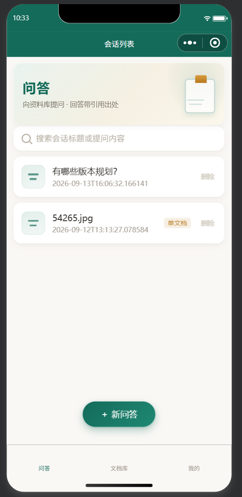
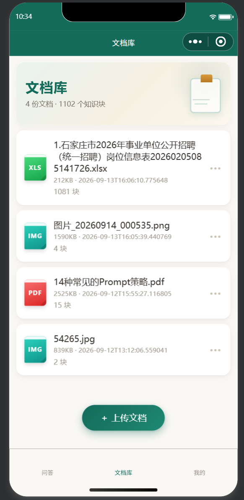
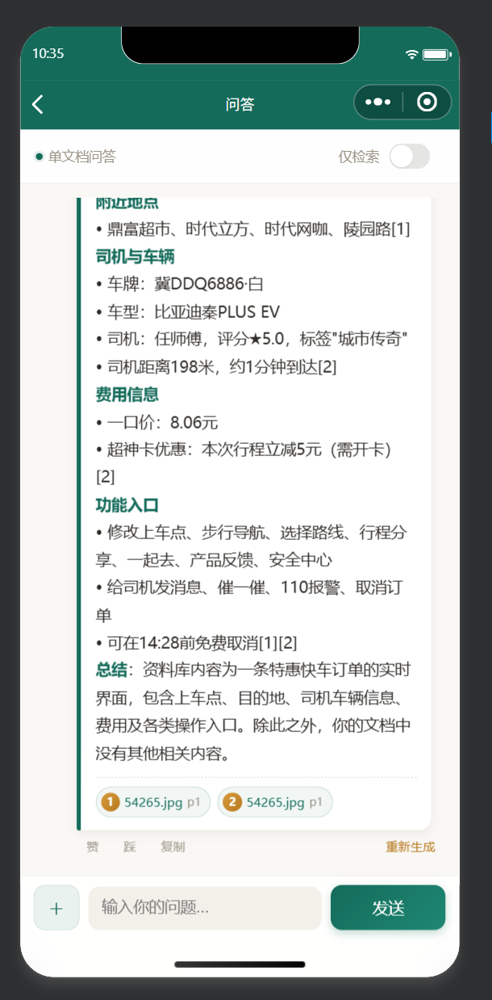
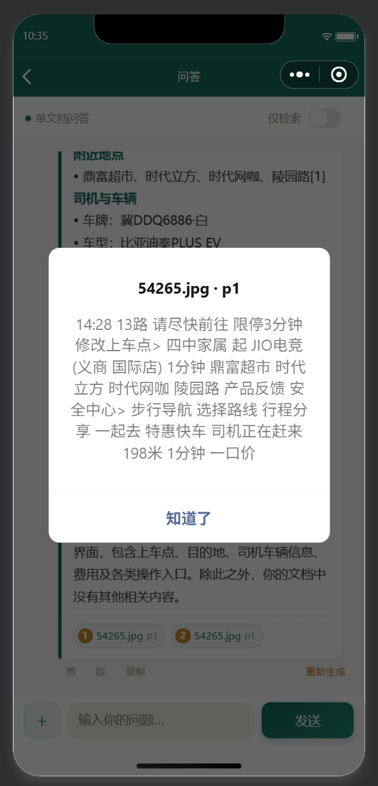
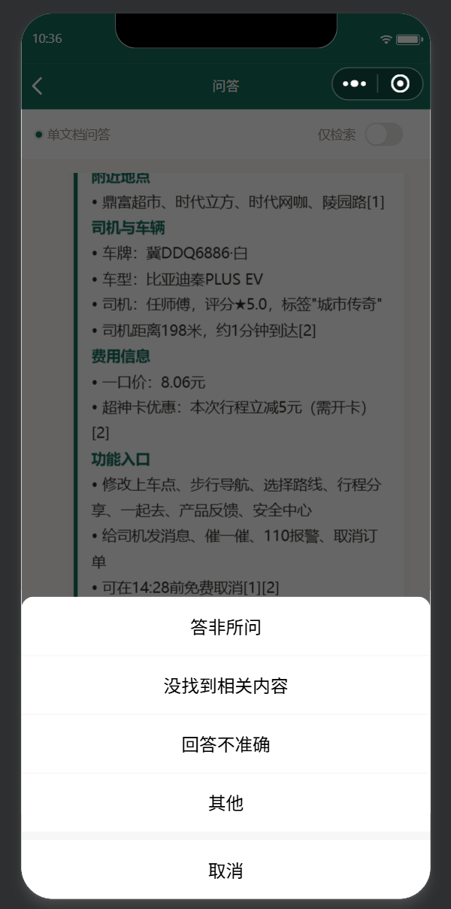
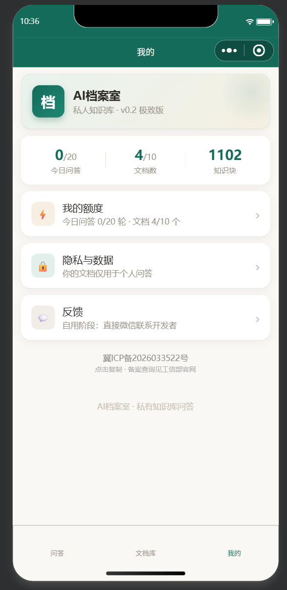
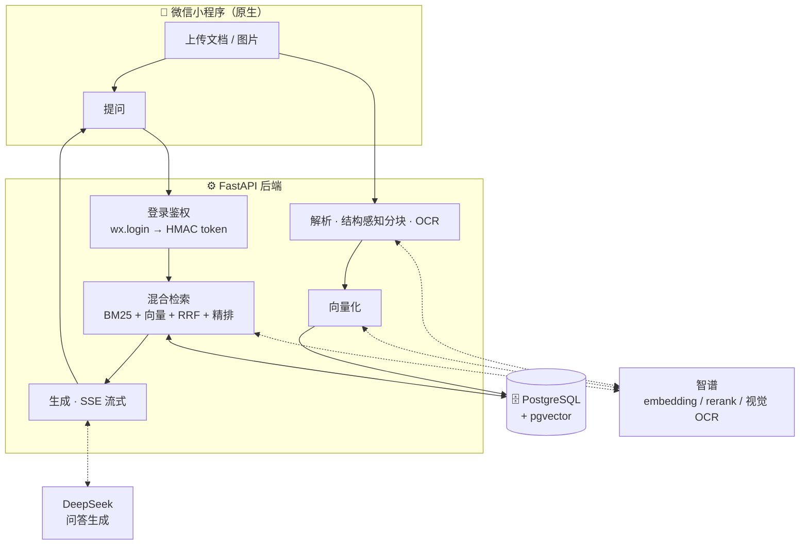

# 🗂️ 我的AI档案室

> 把自己的文档变成 24 小时在线的 AI 助手 —— **上传即问，回答必带出处。**

一个跑在微信里的**私人知识库问答**小程序（RAG）。上传 PDF / Word / 图片 → 自动解析、分块、向量化 → 提问 → 带**引用溯源**的流式回答。

> 个人项目 · 已上线（微信小程序「我的AI档案室」）· 后端 FastAPI + PostgreSQL/pgvector

---

## 📸 界面

| 首页 | 文档库 | 带引用的问答 |
|:---:|:---:|:---:|
|  |  |  |

| 引用溯源 | 赞 / 踩反馈 | 我的 |
|:---:|:---:|:---:|
|  |  |  |

---

## ✨ 功能

- **多来源入库**：手机拍照 / 相册选图 / 聊天文件（含 PDF、Word、PPT、Excel、EPUB、HTML、Markdown、纯文本），图片自动 OCR 转文字
- **结构化解析**：识别标题层级、表格、代码块、列表，做**结构感知分块**（把标题路径作为上下文，提升检索命中）
- **混合检索**：全库 BM25 + 向量召回 → RRF 融合 → 精排（rerank）→ 片段去冗余，答案带**引用出处**（文档名 / 页码 / 原文片段）
- **SSE 流式回答**：逐字输出，正文 Markdown 渲染（标题 / 表格 / 代码高亮）
- **反馈闭环**：赞 / 踩（踩可原因归类）→ 一键重新生成 → badcase 可导出分析
- **微信一键登录**：文档与会话随账号保存；无状态 HMAC token
- **额度体系**：每日问答额度 + 激励广告补充

---

## 🏗️ 架构



线上拓扑：`微信小程序` ⇄ `HTTPS(nginx + 证书)` ⇄ `FastAPI(systemd)` ⇄ `PostgreSQL/pgvector(Docker)`。

---

## 🔬 技术亮点

| 亮点 | 说明 |
|------|------|
| **混合检索 + 精排** | 全库 BM25 与向量召回各自 top-K → RRF 融合 → reranker 精排 → top-N。自建 **golden QA（30+ 条）** 评测：**Recall@6 ≈ 91%** |
| **结构感知分块** | mistune / python-docx 解析标题层级，块携带「标题路径」上下文；代码块 / 表格整体保留 |
| **多格式解析全量** | txt/md/pdf/docx/pptx/xlsx/epub/html/csv + **扫描件/图片 OCR 兜底**（长图按截断自适应切分再合并） |
| **可靠性工程** | SSE 流式收尾守卫 + 看门狗；额度预扣/回补防刷；鉴权 **fail-closed**（非 dev 一律要 token）；幂等启动迁移 |
| **全链路自建** | 从零搭 FastAPI + pgvector，自配 HTTPS、systemd、Docker、每日自动备份，并完成 **ICP 备案** 上架 |

---

## 🧰 技术栈

| 层 | 选型 |
|---|---|
| 前端 | 微信小程序（原生 WXML/WXSS/JS），markdown-it 渲染 |
| 后端 | Python · FastAPI · SQLAlchemy 2.0 · SSE |
| 存储 | PostgreSQL 16 + pgvector（HNSW 向量索引） |
| 检索 | jieba（BM25）· 向量召回 · RRF · rerank（智谱） |
| 模型 | 生成：DeepSeek ｜ 向量/精排/视觉：智谱 BigModel |
| 部署 | 腾讯云轻量 · nginx + TLS · systemd · Docker(PG) · 每日 pg_dump 备份 |

---

## 🚀 本地运行

```bash
# 1) 起数据库（PostgreSQL + pgvector）
cd backend && docker compose up -d          # 或本机 apt 安装 + 建库

# 2) 配置密钥
cp .env.example .env                         # 填 LLM_API_KEY / EMBEDDING_API_KEY

# 3) 起后端
bash scripts/start_backend.sh                # → http://127.0.0.1:8000  （/docs 可看接口）

# 4) 测试
cd backend && ./.venv/bin/python -m pytest -q

# 5) 前端
#    微信开发者工具导入 miniprogram/（开发时勾选「不校验合法域名」直连本机）
```

---

## 📁 目录结构

```
AI档案室/
├── README.md
├── docs/                 # PRD / 开发计划 / 版本记录 / 截图
├── backend/              # FastAPI 后端
│   ├── app/
│   │   ├── routers/      #   API（auth / docs / chat / quota / me）
│   │   └── services/     #   parser / chunker / embedding / retrieval / llm / ocr / processor
│   ├── tests/            #   pytest（parser / chunker / api）
│   └── scripts/          #   评测 / 数据迁移 / 重处理 / badcase 导出
├── miniprogram/          # 微信小程序（chat / docs / mine 三组页面）
└── scripts/              # 本地起服务脚本
```

---

## 🗓️ 迭代记录

- **v1.2**：赞踩闭环（点踩即时反馈 + 原因归类 + 一键重生成）、badcase 导出
- **v1.1**：微信一键登录、会话框附件直传、登录态自愈、流式守卫
- **v1.0**：文档上传 → 解析 → 分块 → 向量化 → 混合检索 → 带引用问答（首次上架）

---

## 📄 License

MIT（见 [LICENSE](LICENSE)）
